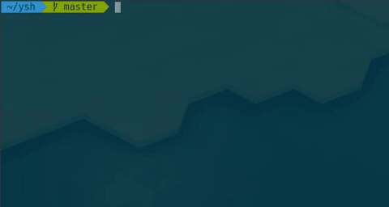

# ysh: the yikes shell

<p align="center">
  
</p>

the yikes shell (also known as ysh) is a basic shell for linux-based systems.
as of right now, it's basically just a hobby of mine and has no real competition with
the likes of bash, zsh, fish, etc., but, i guess only time will tell, because didn't linux
itself just start out as linus torvalds' side project?

go ahead and clone ysh today (fork it too if you want, why not, right?):

```
$ git clone https://github.com/kevinshome/ysh.git
```
## installation

requirements to build from source:

  - libreadline-dev
  - clang
  - make


the installation process for ysh is pretty easy, as it
only revolves around the single Makefile in the root directory:

to install to /usr/bin:

```
$ cd ysh

$ make

$ make install
```

and then all you have to do is type:

```
$ ysh
```
and you'll be in!

## license

ysh is distributed under the MIT license. a copy of the license can be found in the LICENSE file
in the root directory of this repository.
